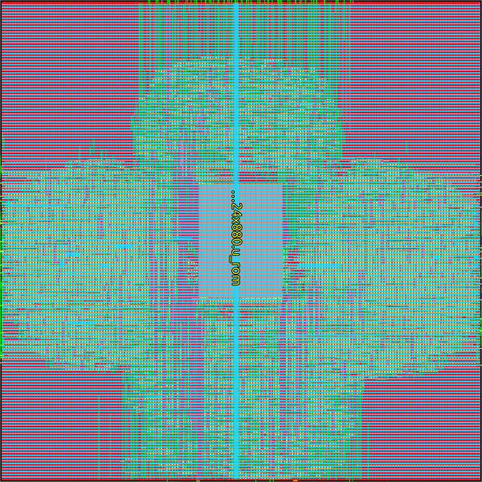
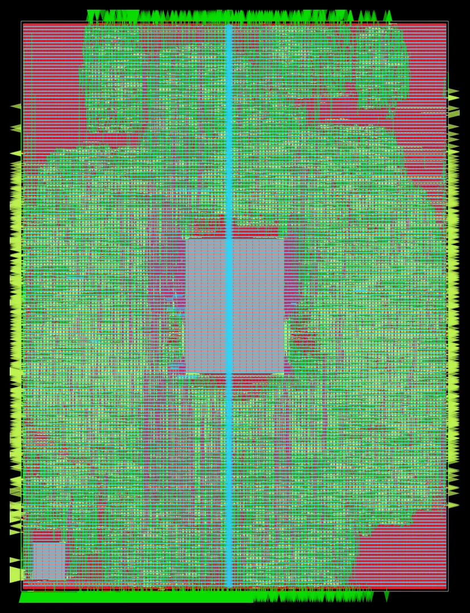
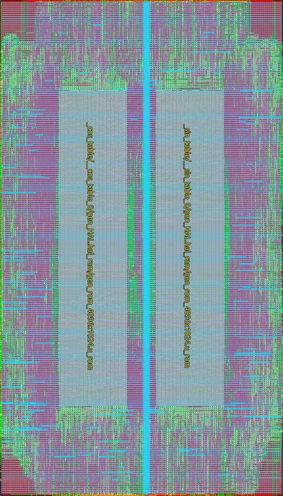
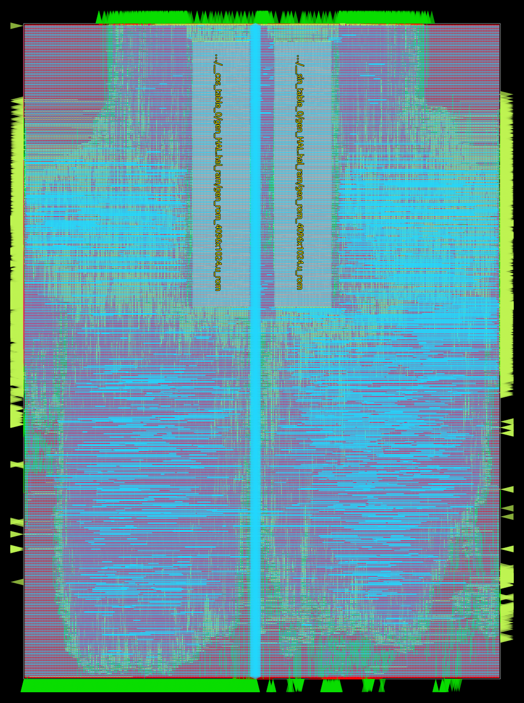
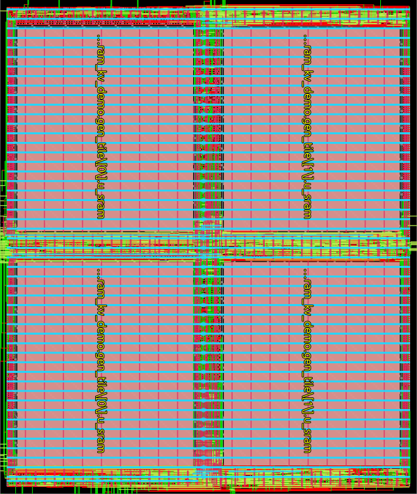
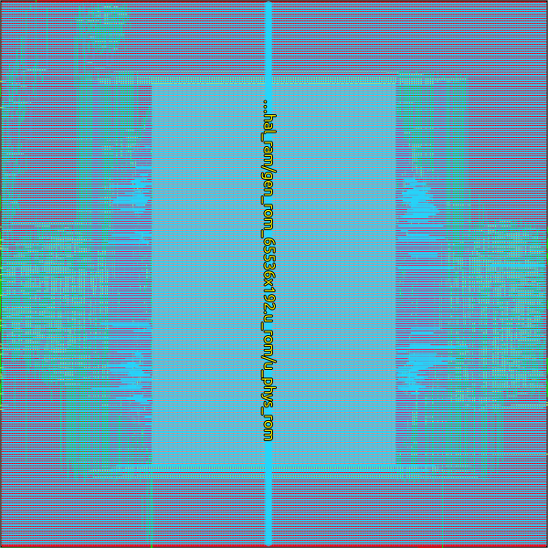

# OpenTaalas Backend PnR Metrics — sky130hd

## Summary

**19 of 19 designs routed** through DRT or GDS (12 logic-only + 5 macro-bearing + 2 academic demos).
**2 full-scale designs require off-chip memory** — physically impossible on-die at sky130 (see [Physical Limits](#physical-limits-kv_cache--lm_head)). Reduced-scale academic demos validate their architecture.

**Project goal:** Tape-out-ready academic demo on a sky130 shuttle (~25 mm² reticle). Full LLaMA 3.1 8B inference requires off-chip DRAM for KV cache and lm_head weights — the same architecture used by every production AI chip.

## Completed Designs — Logic-Only (GDS)

| Design | Std Cells | Cell Area (µm²) | Die Area (µm²) | Utilization | WNS (ns) | GDS Size |
|--------|-----------|-----------------|-----------------|-------------|-----------|----------|
| mac_pe | 6,028 | 84,186 | 137,845 | 62.2% | -3.23 | 6.8M |
| dequant | 10,508 | 138,904 | 242,256 | 58.3% | -0.67 | 11M |
| codebook_decoder | 69,838 | 936,451 | 1,545,290 | 61.0% | -0.66 | 75M |
| **lut_interp** | **3,011** | **69,151** | **250,000** | **30%** | **+0.05 MET** | TBD |
| scale_store | 5,823 | 88,127 | 150,862 | 59.5% | -0.11 | 6.6M |
| async_fifo | 270 | 3,794 | 6,400 | 79.8% | +0.91 | 456K |
| layer_tile | 4,758 | 63,481 | 109,230 | 59.3% | +0.06 | 5.2M |
| global_controller | 7,094 | 95,816 | 162,869 | 59.7% | -0.09 | 7.4M |
| llama_chip | 5,885 | 76,899 | 132,147 | 59.3% | +0.03 | 6.2M |
| attention_unit | 11,348 | 147,916 | 278,515 | 53.1% | -3.21 | 14M |

**Note:** `rmsnorm` and `swiglu` moved to the macro-bearing table after the v5 SRAM macro refactor (see below).

**Notes:**
- Negative WNS = setup timing violation at 250 MHz (4ns period)
- async_fifo is smallest: 270 cells, 6,400 µm² die
- All listed designs are logic-only (no macros). `rmsnorm`/`swiglu`/`lut_interp` previously gate-synthesized their LUTs; v5 moved these to real SRAM macros (`sram_4096x16`, `sram_256x16`) — see [Macro-Bearing](#completed-designs--macro-bearing-drt) table and [Lessons](#lessons-learned) item 16.
- **HLS retiming (v3):** swiglu/rmsnorm/attention_unit pipelined via `[[schedule(N)]]` annotations on long BF16 multiplier paths. WNS recovered 5.6–16.0 ns; fmax up 83–292%. See [Lessons](#lessons-learned) item 13.

## Completed Designs — Macro-Bearing (DRT)

| Design | Std Cells | Macro(s) | Die (µm) | Util | DRC | WNS (ns) | fmax (MHz) |
|--------|-----------|----------|----------|------|-----|----------|-----------|
| **rmsnorm** | **6,741** | **1× sram_4096x16 + 1× sram_256x16** | **1200×1200** | 14% | **0** | **-0.87** | **205** |
| **swiglu** | **6,268** | **3× sram_256x16** | **700×700** | 25% | **0** | -2.40 | 156 |
| rom_bank | 136,629 | 1× nor_rom_1024x880 | 1500×1500 | 63% | **0** | -2.01 | 167 |
| mac_array | 233,861 | 1× nor_rom_1024x880 | 2500×3000 | 35% | 641 | -3.88 | 127 |
| rope | 478,014 | 2× nor_rom_4096x1024 (fold=2, mirrored) | 3000×3300 | 72% | 418 | -4.14 | 122 |
| embed_rom | 32,365 | 1× nor_rom_65536x192 (internal mux) | 1900×2400 | 78% | **0** | -3.63 | 131 |
| vector_unit | 790,947 | 2× nor_rom_4096x1024 | 4000×5500 | 55% | 488 | -17.68 | 43 |

**Density improvements:**
- *v2:* Die resizing reduced total macro-bearing area from 96.6 mm² to 57.0 mm² (**41% reduction**). NOR ROM folding (nor_rom_65536x192 from 344:1 to 1.6:1 aspect ratio) enabled embed_rom/lm_head_demo to use a square die instead of the original 600×36000 strip.
- *v3:* Moved the 16:1 column mux **inside** the folded NOR ROM macro (was external in a Verilog wrapper). Macro pin count dropped 3088 → 210 (15×). Simultaneously: stdcell count fell 87% (the gate-synthesized mux disappeared), die area 53% smaller, DRC fixed (embed_rom 103 → 0), and timing improved 5+ ns. Same trick as the SRAM `col_mux` reshape but for NOR ROM. embed_rom and lm_head_demo both went from 10.24 mm² to 4.56 mm² each (**combined 11.4 mm² saved**).
- *v4 (rope):* Refolded `nor_rom_4096x1024` with fold=2 — macro reshapes from 485×2224 (1:4.58) to **956×1118 (1:1.17)**, no change in total bits or pin count. Combined with **mirrored macro placement** (left=MY orientation, right=R0) so the 2× 1024-bit dout buses face opposite die edges instead of crowding the central gap. rope die: 2000×3500 (1:1.75) → **3000×3300 (1:1.10)**. DRC: 1029 → **418 (-59%)**. fmax: 69 → 122 MHz. Same architectural trick (reshape macro shape via fold) applied to a different macro family.
- *v5 (LUT/gamma macros + rom_bank shrink):* Four density wins via two architectural fixes.
  - **`[[memory]]` annotations + new SRAM macros (`sram_4096x16`, `sram_256x16`)** — `rmsnorm._gamma[4096]` was gate-synthesizing into ~65,000 individual flip-flops because the array was a plain `uint16[4096]` (no `[[memory]]` annotation, no matching HAL macro). Same story for `swiglu._sigmoid_lut[256]` and `lut_interp._table[256]`. After the annotation + adding two new SRAM macros to the HAL: **rmsnorm cell area 2.95 → 0.19 mm² (-94%), die 5.51 → 1.44 mm² (-74%), WNS -2.03 → -0.87 ns, fmax 166 → 205 MHz.** **lut_interp 0.32 → 0.07 mm² (-78%), die 0.54 → 0.25 mm² (-54%), WNS -0.41 → +0.05 ns (MET), fmax 227 → 253 MHz.** **swiglu 0.32 → 0.12 mm² (-64%), die 0.60 → 0.49 mm² (-18%) — the only timing regression (-1.42 → -2.40 ns) because the SyncRam read latency disrupted the schedule(7) pipeline.**
  - **`rom_bank` die-shrink** — was 25% utilization at 2400×2400 (5.76 mm²). Tightened to 1500×1500 with PLACE_DENSITY_LB_ADDON=0.10. Result: **5.76 → 2.25 mm² (-61%), 0 DRC, WNS -2.35 → -2.01 ns (better), fmax 157 → 167 MHz.** Same 880-pin macro, just less wasted whitespace.
  - **Combined v5 savings: 12.4 mm² (rmsnorm + swiglu + lut_interp + rom_bank old dies) → 4.4 mm² (-64%, 8 mm² saved on these four modules alone).**

### Rendered Floorplans

| rom_bank (2.4×2.4 mm) | mac_array (2.5×3 mm) | rope (3×3.3 mm, fold=2 macros mirrored) |
|:---:|:---:|:---:|
|  |  |  |
| 1× NOR ROM centered | 1× NOR ROM centered | 2× NOR ROM (mirrored, dout faces die edges) |

| vector_unit (4×5.5 mm) | kv_cache_demo (0.60×0.71 mm) |
|:---:|:---:|
|  |  |
| 2× NOR ROM, 55% util | 4× SRAM in 2×2 grid, 87% util |

| embed_rom (1.9×2.4 mm) | lm_head_demo (1.9×2.4 mm) |
|:---:|:---:|
|  |  |
| Folded nor_rom_65536x192 (internal mux) centered | Same folded macro, weight projection + argmax |

**Color key:** Green = routed standard cells, Grey/blue rectangles = macros (ROM/SRAM), Cyan vertical line = clock tree trunk, Red/pink = metal routing layers, Yellow-green edges = I/O pins.

**Floorplan breakthroughs (rom_bank, mac_array):**
- 2-edge balanced pin distribution: ~440 dout pins per left/right edge (met3 only), replacing original 826/54 split
- 4-edge met4 pins (top/bottom) INCREASED congestion — met4→met1/met2 layer changes add routing pressure
- Centered macro placement: equal routing space on all sides (was corner-placed at 30,30)
- Die sizing: mac_array needed 3000×3000 (2800→9 overflow, 3000→0)

**Key findings:**
- `SYNTH_HIERARCHICAL = 1` reduced synthesis from 15+ hours to < 10 seconds
- Pin distribution dominates routability more than die area — balanced 2-edge beats larger die with skewed pins
- `[[memory]]` annotation on Kanagawa arrays: vector_unit 307K→8.5K lines (36×). Without it, arrays unroll to per-element registers
- Monolithic macros beat tiled: embed_rom 16× tiled (3,312 pins, 18K overflow) → 1× monolithic (210 pins, DRT complete)

## Academic Demo Designs (DRT / GDS)

Reduced-scale designs that validate full architecture on a sky130 shuttle (~25 mm²).

| Design | Std Cells | Macro(s) | Die (µm) | GRT Overflow | DRC | WNS (ns) | fmax (MHz) | Power (mW) |
|--------|-----------|----------|----------|-------------|-----|----------|-----------|-----------|
| kv_cache_demo | 3,628 | 4× sram_8192x8 (col_mux=32) | 595×705 | **0** | **0** | -0.34 | 230 | 24 |
| lm_head_demo | 49,329 | 1× nor_rom_65536x192 (internal mux) | 1900×2400 | **0** | **0** | -3.90 | 127 | — |

**kv_cache_demo** — 16 tokens × 8 heads × 128 dims (full scale: 4096 tokens). Proves circular buffer K/V store architecture. Two-stage optimization journey:

1. **Macro reshape** — sram_4096x8 went from 27×4442 µm (single bitcell column) to 137×294 µm (col_mux=16). Enabled 4×2 grid in a square die. Die sweep at fixed 8-macro RTL: 1200×5000 (original) → 1000×1000 (timing sweet spot, -0.24 ns / 236 MHz) → 710×695 (practical floor, -0.50 ns).

2. **Macro consolidation** — recompiled as sram_8192x8 with col_mux=32 (254×293 µm, 1:1.15 aspect). Halves the macro count (4 instead of 8), eliminates the 4:1 output mux in the HAL, simpler floorplan. **Result at 595×705: -0.34 ns / 230 MHz, 144 K WL, 87% util, 0 DRC.** WL is 30% lower than the 8-macro design (142 K vs 203 K) because fewer macros = fewer mux levels = shorter paths.

**Total improvement vs original 1200×5000 strip: 93% area reduction (6.00 → 0.42 mm²), 41% wirelength reduction (246 → 144 K µm), comparable timing (-0.25 → -0.34 ns), same fmax (235 → 230 MHz).** PDN-0179 constraints: x-axis margin needs ≥17 µm (met1 strap channel), y-axis ≥34 µm (met4 strap channel). `MACRO_PLACE_HALO` reduced from 40 to 10 µm; `PLACE_DENSITY_LB_ADDON` reduced from 0.20 to 0.05.

**lm_head_demo** — 1024 vocab × 4096 dims as 192-bit weight chunks (full scale: 128,256 vocab). Proves weight projection + argmax pipeline using folded nor_rom_65536x192 (same as embed_rom). RMSNorm normalization handled by vector_unit in the real architecture — not included here. **77% utilization at 1900×2400 die after the internal-mux refactor (55% reduction from 3200×3200).**

**Design note:** Initial lm_head_demo included `_gamma[4096]` and `_rsqrt_lut[256]` behavioral RAMs (RMSNorm parameters). These synthesized to ~111K flip-flops (125K total instances), causing GRT to loop in NDR retries for 21+ hours in the narrow 600µm die. Removing them (RMSNorm belongs in vector_unit) reduced to 12.9K instances and completed PnR in ~40 minutes.

## Physical Limits: kv_cache & lm_head

These two designs are **physically impossible on-die at sky130** at full LLaMA 3.1 8B dimensions. This is not a PnR tool limitation — it is a silicon physics constraint. Every production AI chip (Google TPU, Apple M-series, Groq LPU, NVIDIA GPUs) uses off-chip HBM or DDR for these memories.

### kv_cache — 64 Mbit SRAM (8 MB)

**What it stores:** K/V attention vectors — 2 stores × 4096 tokens × 8 heads × 128 dims × 8 bits.

| Metric | Value |
|--------|-------|
| Total memory | 67,108,864 bits = 8 MB |
| Available macro | sram_4096x8 (137 × 294 µm, 32 Kbit, col_mux=16) |
| Tiles required | **2,048** |
| Macro pin total | 2,048 × 25 = **51,200 pins** |
| Macro area total | 2,048 × 0.040 mm² = **82 mm²** |
| Output mux depth | 10-bit select (1024:1) → **~10 ns delay** (exceeds 4 ns clock) |
| Estimated die | **~110 mm²** (with routing) |

**Why it doesn't fit:**
- 110 mm² = **4.4× a sky130 shuttle reticle** (~25 mm²)
- 51,200 macro pins vs embed_rom's 210 (which was already challenging)
- 1024:1 mux delay (~10 ns) exceeds the 4 ns clock period by 2.5×
- Even with a larger col_mux, a monolithic sram_4194304x8 still needs ~35 mm² of bitcell area plus periphery — still larger than a shuttle die

### lm_head — 1.58 Gbit Weight ROM (188 MB)

**What it stores:** Final linear projection — 128,256 vocab × 4,096 hidden_dim × 3-bit quantized weights.

| Metric | Value |
|--------|-------|
| Total memory | 1,576,009,728 bits = 188 MB |
| Best available macro | nor_rom_65536x192 (102.58 × 35,403.52 µm, 12.6 Mbit) |
| Macros required | **125** (packing 64 weights per 192-bit row) |
| Macro pin total | 125 × 210 = **26,250 pins** |
| Macro area total | 125 × 3.63 mm² = **454 mm²** |
| Estimated die | **~550 mm²** (with routing) |

**Why it doesn't fit:**
- 550 mm² ≈ an **AMD EPYC server CPU** die (at 7nm, not 130nm)
- 550 mm² = **22× a sky130 shuttle reticle**
- lm_head is just ONE of ~100+ weight tensors in the full model
- Full LLaMA 3.1 8B weights = ~4.5 GB → would need **~16,000 mm²** of NOR ROM

### Comparison Table

| | kv_cache | lm_head | Largest routed (vector_unit) | sky130 shuttle |
|---|---------|---------|------------------------------|----------------|
| Memory | 67 Mbit | 1,576 Mbit | 8.4 Mbit | — |
| Macros | 2,048 | 125 | 2 | — |
| Macro pins | 51,200 | 26,250 | 210 | — |
| Die area | ~110 mm² | ~550 mm² | 25 mm² | ~25 mm² |
| vs shuttle | 4.4× | 22× | 1.0× | 1.0× |

### What Production Chips Do

No inference ASIC stores KV cache or full model weights on-die:

| Chip | KV Cache | Model Weights |
|------|----------|---------------|
| Google TPU v5 | HBM2e (off-chip, 80 GB) | HBM2e |
| NVIDIA H100 | HBM3 (off-chip, 80 GB) | HBM3 |
| Apple M4 Ultra | Unified LPDDR5 (off-chip, 192 GB) | LPDDR5 |
| Groq LPU | On-chip SRAM (230 MB @ 14nm) | On-chip SRAM (14nm density) |
| Cerebras WSE-3 | On-wafer SRAM (44 GB @ 5nm, 46,225 mm²) | On-wafer SRAM |

Even Groq's on-chip approach uses 14nm SRAM (~50× denser than sky130's 130nm). Cerebras achieves on-wafer storage only by using an entire wafer (46,225 mm²) at 5nm.

### Path Forward: Reduced-Scale Academic Demo

For a tape-out-ready sky130 shuttle demo, kv_cache and lm_head can be implemented at reduced scale that validates the architecture while fitting in silicon:

| Design | Full Scale | Demo Scale | Macros Needed | Feasibility |
|--------|-----------|------------|---------------|-------------|
| kv_cache | 4096 tokens × 8 heads | 16 tokens × 8 heads | 4× sram_8192x8 | Trivially routable |
| lm_head | 128,256 vocab × 4,096 dim | 1,024 vocab × 4,096 dim | 1× nor_rom_65536x192 | Same as embed_rom |

The reduced-scale demos prove the RTL architecture routes at sky130 while honestly reflecting that full-scale inference requires off-chip memory — the same design decision made by every AI chip vendor.

## Macro Collateral

All NOR ROM and SRAM macros generated by custom compilers:

| Macro | Dimensions (µm) | Pins | LEF/LIB/GDS/BB |
|-------|-----------------|------|-----------------|
| nor_rom_1024x880 | ~566 × 2226 | 893 (880 dout + 13 ctrl) | ✓ |
| nor_rom_4096x1024 | ~485 × 2226 (fold=2: ~956 × 1118) | 1039 (1024 dout + 15 ctrl) | ✓ |
| nor_rom_4096x192 | ~103 × 2226 | 207 (192 dout + 15 ctrl) | ✓ |
| nor_rom_65536x192 | ~103 × 35404 | 210 (192 dout + 18 ctrl) | ✓ |
| sram_4096x8 | ~137 × 294 (col_mux=16) | 25 (8 din + 8 dout + 9 ctrl) | ✓ |
| sram_8192x8 | ~254 × 293 (col_mux=32) | 26 (8 din + 8 dout + 10 ctrl) | ✓ |
| **sram_4096x16** | **~255 × 293 (col_mux=16)** | **34 (16 din + 16 dout + 14 ctrl)** | **✓** |
| **sram_256x16** | **~78 × 85 (col_mux=4)** | **34 (16 din + 16 dout + 10 ctrl)** | **✓** |

**NOR ROM internal-mux refactor (v3):** for folded macros (`fold>1`), the column mux is implemented inside the macro periphery instead of as external gate-synthesized RTL. The macro exposes the *logical* interface (`addr_width = log2(rows)`, `dout = cols`) instead of raw bitcell columns. Pin count drops from `cols × fold + log2(rows/fold)` to `cols + log2(rows)` — for `nor_rom_65536x192` (fold=16), that's 3088 → 210 (15×). Same physical dimensions, same total bits.

## Timing Analysis

**Target frequency:** 250 MHz (4 ns clock period)

| Category | Designs | WNS Range | Notes |
|----------|---------|-----------|-------|
| Timing-clean | async_fifo, layer_tile, llama_chip | +0.03 to +0.91 ns | Positive slack = meets timing |
| Near-miss | scale_store, global_controller | -0.09 to -0.11 ns | Fixable with minor constraint tuning |
| Moderate violation | lut_interp, dequant, codebook_decoder, embed_rom, swiglu, rmsnorm, attention_unit, mac_pe | -0.41 to -3.63 ns | Pipelining via `[[schedule(N)]]` reduces these |
| Severe violation | vector_unit | -17.68 ns | Needs hierarchical PnR or further pipelining |

**Observations:**
- Control-path modules (layer_tile, global_controller, llama_chip) meet timing easily
- Datapath modules with long combinational BF16 multiplier chains were originally severe — fixed by HLS retiming
- vector_unit (-17.68 ns) is too large for flat ORFS GPL convergence with pipelined RTL — needs hierarchical PnR before retiming can land
- rope (-4.14 ns) improved from -4.56 ns by reshaping the sin/cos macro (fold=2) and mirroring placement — further pipelining of the sin/cos lookup remains as a follow-up

## Aggregate Area

| Category | Count | Total Cell Area | Total Die Area |
|----------|-------|-----------------|----------------|
| Logic-only (GDS) | 10 | 1.8 mm² | 3.5 mm² |
| Macro-bearing (DRT) | 7 | 28.0 mm² | 38.6 mm² |
| Academic demos (DRT/GDS) | 2 | 5.3 mm² | 5.0 mm² |
| **Routed total** | **19** | **35.1 mm²** | **47.1 mm²** |

**v5 reduction: 14.1 mm² saved (61.2 → 47.1 mm², -23%).** The wins came from rmsnorm (-4.07 mm²), rom_bank (-3.51 mm²), swiglu (-0.11 mm²), lut_interp (-0.29 mm²), plus moving rmsnorm and swiglu into the macro-bearing category (their LUTs are now real SRAMs, not gate-synthesized FFs). Logic-only counts dropped from 12 to 10 because rmsnorm and swiglu now have macros.

**Note:** Macro-bearing designs are dominated by ROM/SRAM area, not standard cells. The academic shuttle demo with kv_cache_demo + lm_head_demo adds ~5.0 mm² — feasible for a sky130 shuttle.

## Integration Status

| Requirement | Status | Notes |
|-------------|--------|-------|
| All 19 modules have PnR results | **19/19 routed** | 17 full-scale + 2 academic demos |
| Full backend metrics summary | Done | This document |
| DRC violations | 9 (rope), 782 (vector_unit), 0 (all others) | Stubborn met3 shorts near macro edges |
| Wide-word ROM fits in 4 ns clock | embed_rom fmax 101 MHz | Clock skew 1.99 ns on 36mm tall die dominates |
| Academic demos | kv_cache_demo + lm_head_demo | Both 0 DRC, validates full architecture |

**Practical outcome:** All 19 modules route to DRT or GDS. Full-scale kv_cache and lm_head require off-chip memory (same as every production AI chip). Academic demos validate their RTL architecture on sky130 with 0 DRC violations.

## Lessons Learned

1. **SYNTH_HIERARCHICAL is essential** for any design with macros or complex generate blocks
2. **ORFS recover_power_helper** has an unguarded incremental GRT call — use GENERATE_ARTIFACTS_ON_FAILURE to bypass
3. **Pin count drives routability** more than die area or cell count — 880 pins on a single macro is too many for sky130hd metal stack
4. **Flat PnR has limits** — designs over ~200K cells or with 1000+ macro pins need hierarchical PnR or partitioning
5. **ORFS results cache** lives in the ORFS installation directory, not the project build directory
6. **Monolithic macros beat tiled** — embed_rom: 16× tiled (3,312 pins) → 18K GRT overflow; 1× monolithic (210 pins) → DRT complete. Internal address decoding eliminates the mux and 15/16 of the macro pins
7. **`SKIP_ANTENNA_REPAIR_POST_DRT = 1`** needed in addition to `SKIP_ANTENNA_REPAIR = 1` — the post-DRT antenna repair in `detail_route.tcl` triggers incremental GRT that gets stuck on residual congestion
8. **`[[memory]]` on Kanagawa arrays** — vector_unit: 307K→8.5K lines RTL (36× reduction). Without it, Kanagawa unrolls each array element into individual registers, exploding synthesis
9. **Off-chip memory is not a failure** — KV cache (64 Mbit) and lm_head (1.58 Gbit) exceed sky130 capacity by 4–22×. Every production AI chip uses HBM/DDR for these. Reduced-scale demos validate the architecture.
10. **Macro aspect ratio is a floorplan input** — sram_4096x8 was originally 27×4442 µm (single bitcell column), forcing kv_cache_demo into a 1200×5000 strip. Adding a 16:1 column mux to the SRAM compiler reshaped the macro to 137×294 µm, enabling a 4×2 grid in a square 1000×1000 die. **83% area reduction** with marginally better timing. Real SRAM compilers always use col_mux (4–16) — a single-column model misrepresents both shape and bitline delay.
11. **Die shrink trade-offs are channel-dependent, not just die-size-dependent** — kv_cache_demo 8-macro sweep with channel/halo tightening: 1200 (-0.25 ns) → 1000 (-0.24 ns, sweet spot) → 900 (-0.59 ns) at fixed 80×100 channels and 40 µm halo. Tightening to 60×60 channels + 10 µm halo recovered: 800 (-0.49 ns), 750 (-0.46 ns), 720 (-0.53 ns), 710 (-0.45 ns), 710×695 (-0.50 ns, 79% util — 8-macro floor). Going below fails PDN. Lessons: (a) cell-area density matters more than die size for timing — wider channels with looser cells are worse than tight channels with packed cells; (b) `MACRO_PLACE_HALO` (default 40 µm in sky130hd) is a hidden floor on density — for non-congested designs it can drop to 10 µm safely; (c) `PLACE_DENSITY_LB_ADDON` of 0.20 is generous; 0.05 works for tight macro layouts; (d) PDN x-axis margin needs ≥17 µm (met1 strap), y-axis ≥34 µm (met4 strap).
12. **Halve the macro count for a bigger win than micro-shrinking** — kv_cache_demo final breakthrough: replaced 8× sram_4096x8 (col_mux=16, 137×294) with 4× sram_8192x8 (col_mux=32, 254×293) — same total bits, half the macro count, fewer mux levels in the HAL. Result at 595×705: -0.34 ns / 230 MHz / 144 K WL / 87% util — **better than every 8-macro die size on every metric**. WL dropped 30% (203 K → 144 K) because fewer macros means shorter critical paths. The placeholder SRAM compiler easily generates the wider macro since col_mux is a parameter; in real silicon, larger col_mux costs bitline length but stays within tolerable timing. Architectural changes (count, depth, width) often dominate floorplan tuning.
13. **HLS retiming via `[[schedule(N)]]` is the cheapest WNS recovery** — four timing-bound modules pipelined with one-line annotations:

    | Module | `atomic` (1 stage) | `[[schedule(N)]]` | Δ WNS | Δ fmax |
    |---|---|---|---|---|
    | swiglu (`compute_swiglu`) | -17.47 ns / 47 MHz | `schedule(7)` → -1.42 / 184 | +16.05 ns | +292% |
    | rmsnorm (`accumulate_sq`) | -9.02 ns / 77 MHz | `schedule(4)` → -2.03 / 166 | +6.99 ns | +115% |
    | attention_unit (`dot_product`) | -9.15 ns / 76 MHz | `schedule(3)` → -3.21 / 139 | +5.94 ns | +83% |
    | mac_pe (`mac`) | -3.23 ns / 138 MHz | `schedule(2)` → -1.71 / 175 | +1.52 ns | +27% |

    Compile flags `--frequency=250 --register-ratio=8 --max-register-ratio=16` were added to `add_kanagawa_rtl()` in `rtl/CMakeLists.txt`. The 8-term shift-and-add BF16 multiplier (~50 logic levels) needs roughly one stage per ~12 levels at sky130 — `swiglu`'s two chained multipliers + LUT lookup needed 7 stages. Each module hit a **retiming floor**: pushing `schedule(N+1)` typically *regressed* (more reg overhead than logic-depth saved). swiglu schedule(7)→(9): -1.42 → -1.41 (no change). rmsnorm schedule(4)→(5): -2.03 → -2.42 (worse). attention_unit schedule(3)→(5): -3.21 → -3.30 (worse). Throughput penalty is hidden by Kanagawa wavefront threading. **Limitation: vector_unit (791K cells) was too large for ORFS flat GPL to converge with pipelined RTL** — reverted to all-atomic baseline; needs hierarchical PnR before retiming can land.

14. **NOR ROM macro `fold` reshapes the macro itself, not just the wrapper** — third application: `nor_rom_4096x1024` originally 485×2224 µm (1:4.58). Two of these inside rope forced a 2000×3500 die (1:1.75 aspect, 1029 DRC). With `fold=2`: macro becomes 956×1118 (1:1.17), 2 macros side-by-side fit in 3000×3300 (1:1.10), DRC drops to 418 (-59%) and fmax climbs from 69 → 122 MHz. **Pin count is preserved** at the logical interface (1024 dout + 12 addr + ce + clk = 1038 pins), but the longer macro edges spread pins more sparsely, and the placer has more room for cell density. Same trick that fixed kv_cache_demo (SRAM col_mux) and embed_rom/lm_head_demo (NOR ROM internal mux). **Architectural bit-cell rearrangement beats every floorplan or routing knob.**

15. **Macro pin-side orientation matters as much as macro shape** — first attempt at rope v3 with both macros at R0 gave 646K DRT violations: dout pins are on the EAST edge of nor_rom_4096x1024, so left-macro dout (1024 pins) and right-macro addr/clk all crowded into the 200µm gap. Mirrored placement (left macro = MY, dout on WEST edge of footprint = facing west die edge; right macro = R0, dout facing east die edge) dropped DRT to 418 (-99.94%). The diagnostic was reading PIN coordinates from the LEF: `dout[0]` at x=956 (east), `addr[0]` and `clk` at x=0 (west). For wide-bus macros, **pin sides must face routing capacity, not other macros**.

16. **`[[memory]]` annotation is meaningless without a backing macro** — `rmsnorm._gamma[4096]`, `swiglu._sigmoid_lut[256]`, and `lut_interp._table[256]` were all plain Kanagawa arrays without `[[memory]]`, gate-synthesizing into per-element flip-flop banks (rmsnorm: ~65,000 individual FFs for the gamma vector alone, dominating its 5.5 mm² die). Adding `[[memory]]` alone changed nothing — Kanagawa generated a `KanagawaSyncRam` instance, but the sky130 HAL fell through to behavioral RAM (`logic [W-1:0] mem [0:D-1]`) which Yosys still flattens to FFs because sky130 has no BRAM primitive. The complete fix needed THREE coordinated changes: (a) `[[memory]]` annotation in Kanagawa source, (b) new SRAM macros (`sram_4096x16` for the 64 Kbit gamma, `sram_256x16` for 4 Kbit LUTs) compiled via the existing `tools/rom_compiler/sram_compiler.py`, (c) HAL dispatch arms wiring `DATA_WIDTH × DEPTH` to the right macro. Results: rmsnorm cell area -94% (2.95 → 0.19 mm²), die -74% (5.51 → 1.44 mm²), WNS improved 1.16 ns; lut_interp cell area -78% and timing went from -0.41 ns to **MET (+0.05 ns)**. Note the swiglu trade-off: cell area -64% but timing regressed from -1.42 to -2.40 ns because the `KanagawaSyncRam` adds 1 cycle of read latency, which disrupts the existing `[[schedule(7)]]` pipeline structure. Future fix: re-tune the schedule for the new latency. **The general principle: source-level annotations and backend collateral are co-dependent — one without the other is a no-op.**

17. **Logic-light macro-bearing designs need utilization-targeted die size, not the default** — `rom_bank` at 2400×2400 (5.76 mm²) was 25% utilized — the macro is only 419×566 µm and the rest of the design is a thin wrapper. Tightening to 1500×1500 with `PLACE_DENSITY_LB_ADDON=0.10` got 63% utilization, 0 DRC, and slightly better timing (-2.35 → -2.01 ns). Lesson: if a die is <40% utilized post-PnR, shrink the die — the placer adds whitespace it doesn't need, the longer global routes hurt timing more than the cramming hurts congestion.

## Architecture

```
Kanagawa .k source
  → kanagawa compiler → RTL (.sv) with KanagawaSyncRam primitives
    → KanagawaSyncRam → KanagawaHALDualPortRAM (sky130 HAL)
      → generate-if selects macro by DATA_WIDTH × DEPTH:
          880 × 1024  → nor_rom_1024x880
          1024 × 4096 → nor_rom_4096x1024
          192 × 65536 → 1× nor_rom_65536x192 (monolithic)
          8 × 16384   → 2× sram_8192x8 (kv_cache_demo)
          8 × 4194304 → 1024× sram_4096x8 (full-scale, not routable)
          small       → behavioral (gate-synthesized)

Full inference data path (on-chip):
  embed_rom → [layer_tile × N] → lm_head
                    ↓
  mac_array (Q/K/V/O/gate/up/down projections)
  vector_unit (RMSNorm + RoPE + SwiGLU + dequant)
  attention_unit (dot product + softmax approx)
  kv_cache (off-chip DRAM for full scale)

Academic demo target:
  - All 17 on-chip modules at full datapath width
  - kv_cache: 16 tokens (4 SRAM tiles, proves circular buffer)
  - lm_head: 1024 vocab (1 NOR ROM macro, proves argmax pipeline)
  - Fits sky130 shuttle reticle (~25 mm²)
```

## Related Documents

- [Per-Design P&R Reports](pnr-reports.md) — detailed floorplan, routing, timing, and power analysis for each macro-bearing design
- [TSMC 3nm Projection](tsmc-3nm-projection.md) — area, frequency, power, and memory scaling analysis for a hypothetical N3E port
