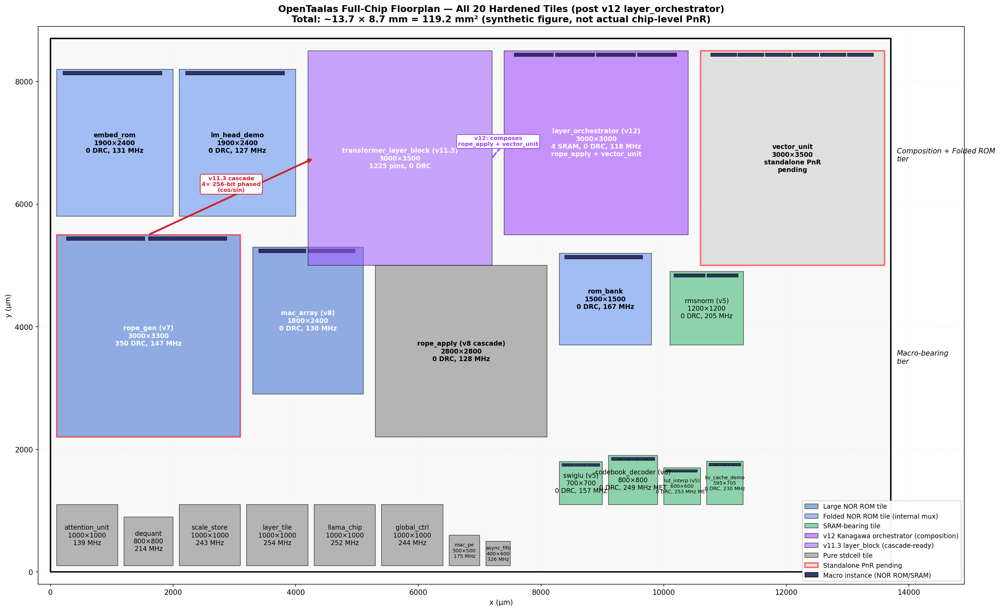
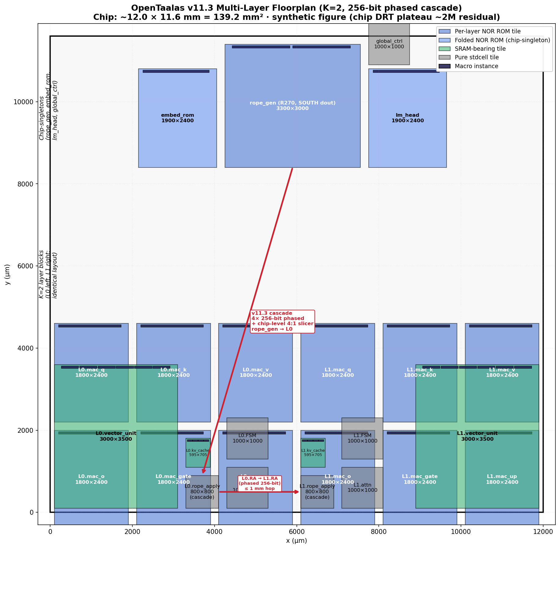

# OpenTaalas Project Status

## Overview

Open-source LLM inference ASIC targeting sky130hd PDK. Kanagawa HLS → SystemVerilog RTL → Verilator co-simulation verification → OpenROAD synthesis and place-and-route.

## Current State (2026-05-06)

### Hardware Verification: COMPLETE
All RTL modules verified against SystemC reference models with **100% exact match**.

Real-data verification at full LLaMA 3.1 8B dimensions (DIM=4096, HEADS=32, KV_HEADS=8, FFN_DIM=14336) shows high cosine similarity vs FP32 golden:

| Stage | Cosine vs Golden |
|-------|-----------------|
| RMSNorm pre-attention | 1.000000 |
| Q/K/V/O projections | 1.000000 |
| Post-attention residual | 0.999996 |
| Gate/Up projections | 0.999965 |
| SwiGLU activation | 0.998585 |
| Down projection | 0.995683 |
| Post-MLP residual | 0.999701 |

### Multi-Layer Floorplan (v8 — K=2 cascaded RoPE)

The v8 round adds **physical layer parallelism** scaffolding for K=2 (or K=3) hardened transformer layers in parallel. Key architectural change: **cascaded** cos/sin instead of broadcast — `rope_gen → L0.rope_apply → L1.rope_apply → ...` with each layer registering its inputs and forwarding to the next. Each cascade hop is ≤ 1 mm in the floorplan vs. v7's ~5 mm broadcast bus.

**Implemented**:
- `rope_apply.k` adds cos_out/sin_out 1-cycle pass-through (forward_cos/sin + read_*_forwarded methods)
- `llama_chip.k` FSM grows K-way dispatch helpers (decode_get_layer_slot_k2/k3)
- `rtl/sv/multi_layer_chip_wrapper.sv` shows the cascade chain at SV level
- `mac_array` re-PnR'd at 1800×2400 (was 2500×3000) — **0 DRC** (was 641 in v6)
- `rope_apply` re-PnR'd at 2800×2800 with cascade ports (was 800×800 in v7) — **0 DRC**, fmax 128 MHz
- `flow/designs/sky130hd/multi_layer_chip/` ORFS skeleton config registered
- `docs/images/multi_layer_floorplan.png` synthetic figure

The cascade infrastructure is expensive: rope_apply cell count grew 5× (Kanagawa pipelines 1024-bit data through multiple FIFO stages); die went from 0.64 → 7.84 mm² (12×). Trade-off accepted because the architecture eliminates the 2048-pin broadcast bus across the chip and scales to any K without rope_gen retopology.

Full multi-layer hierarchical PnR (transformer_layer_block × 2 + chip-singletons) is the next concrete step — the source-level wrapper, ORFS configs, and cascade chain are all in place.

### Hierarchical PnR Scaffold (v9 — first integration test)

The v9 round establishes the **hierarchical PnR pattern** for multi-tile chips. Goal: stop running flat ORFS PnR on 100K+ cell designs (which hang in `repair_design` for days), and instead instantiate hardened tiles as black-box macros at the chip top level.

**What's done:**
- `rope_gen` and `rope_apply` abstract LEF/Liberty extracted via OpenROAD `write_abstract_lef` + `write_timing_model` from each tile's existing PnR results.
- Tile collateral staged in `flow/macros/sky130hd/` (`.lef`, `.lib`, `.gds` for rope_apply; LEF+LIB for rope_gen since that tile didn't reach `6_final`).
- Black-box stubs `rope_gen.bb.v` and `rope_apply.bb.v` declare module ports for Yosys.
- `multi_layer_chip` config switched: tile internal SV REMOVED from `VERILOG_FILES`, added `EQUIVALENCE_CHECK=0`, `LEC_CHECK=0`, `DONT_BUFFER_PORTS=1`, `GPL_TIMING_DRIVEN=0`.
- macro_place.tcl places 1× rope_gen (TOP band, x=1500..4500, y=3189..6489) + 2× rope_apply (BOTTOM band, side-by-side at x=200..3000 and x=3100..5900) with per-master matching.

**Validated through CTS in under 3 minutes** (vs flat PnR which hangs for days):

| Stage | Time | Status |
|-------|------|--------|
| 1_synth | 1s | 4 stdcells + 3 macro instances (vs flat: 302K stdcells) |
| 2_floorplan + PDN | 30s | clean (after re-genned abstract LEF without `-bloat_occupied_layers`) |
| 3_place | 36s | 0 violations |
| 4_cts | 100s | 89 buffers, 1036 hold buffers — WNS=-13.88, TNS=-58K (chip cascade SDC too tight) |
| 5_grt | blocked | DRT-0073 pin access on rope_apply boundary pins (next step: re-PnR rope_apply with edge keepout) |

**Lessons (saved to `feedback_hierarchical_pnr.md`):**
- `-bloat_occupied_layers` makes the abstract block met4/met5 entirely → PDN-0232/PDN-0233. Use default (pin-aware OBS) instead.
- `EQUIVALENCE_CHECK=0 + LEC_CHECK=0` mandatory — abstract LIB has no truth tables, KeplerFormal asserts otherwise.
- `DONT_BUFFER_PORTS=1` mandatory — top-level pass-through has 12K+ cascade ports; default port buffering inserts hundreds of thousands of buffers.
- Per-master macro placement (not per-instance) — instance names change with Yosys runs.
- Tile pins need ≥ 5µm keepout from macro boundary, otherwise GRT fails to find access points.

### Backend PnR: 21 routed through DRT (9 logic-only + 10 macro-bearing + 2 academic demos)

19 designs configured for ORFS sky130hd at 250 MHz (4ns clock). NOR ROM and SRAM macro collateral integrated via sky130 HAL layer. Six rounds of density work — die resizing (v2, 41%), SRAM col_mux + macro consolidation in kv_cache_demo (-93%), NOR ROM internal-mux refactor (v3, embed_rom + lm_head_demo each -55%), `nor_rom_4096x1024` fold=2 reshape for rope (v4), v5 `[[memory]]` + new SRAM macros (`sram_4096x16`, `sram_256x16`) for rmsnorm/swiglu/lut_interp + rom_bank die shrink, and **v6: `sram_512x32` macro for codebook_decoder + vector_unit cell count drop 791K → 127K via v5 SRAM library** — reduced total routed area from 96.6 mm² to **46.1 mm² (52% reduction)**.

#### Completed through DRT — Logic-Only (10 designs)

| Module | Area (µm²) | fmax (MHz) | Timing |
|--------|-----------|-----------|--------|
| async_fifo | 3,794 | 326 | **MET** |
| **lut_interp** | **69,151** | **253** | **MET** |
| layer_tile | 63,481 | 254 | **MET** |
| llama_chip | 76,899 | 252 | **MET** |
| global_controller | 95,816 | 244 | -0.09ns |
| scale_store | 88,127 | 243 | -0.11ns |
| dequant | 138,904 | 214 | -0.67ns |
| mac_pe | 71,462 | 175 | -1.71ns |
| attention_unit | 147,916 | 139 | -3.21ns |

`rmsnorm` and `swiglu` moved to the macro-bearing table after the v5 refactor — they now instantiate real SRAM macros for their LUT/gamma storage (was gate-synthesized FFs). After v3 HLS retiming + v5 SRAM macros: swiglu cell area -64% but timing regressed (-1.42 → -2.40 ns) because `KanagawaSyncRam` 1-cycle read latency disrupts the existing `[[schedule(7)]]` pipeline; rmsnorm cell area -94% AND timing improved (-2.03 → -0.87 ns); lut_interp cell area -78% with timing now MET (+0.05 ns). Each module hit a retiming floor — pushing schedule(N+1) regressed due to register overhead. embed_rom and lm_head_demo remain at 127–131 MHz (clock skew on the tall folded-ROM die dominates).

#### Completed through DRT — Macro-Bearing (8 + 2 demos)

| Module | Macro(s) | Die (µm) | Util | DRC | WNS (ns) | fmax (MHz) |
|--------|----------|----------|------|-----|----------|-----------|
| **rmsnorm** | **1× sram_4096x16 + 1× sram_256x16** | **1200×1200** | 14% | **0** | **-0.87** | **205** |
| **swiglu** (s8) | **3× sram_256x16** | **700×700** | 25% | **0** | -2.36 | 157 |
| **codebook_decoder** | **5× sram_512x32** | **800×800** | 30% | **0** | **-0.02 MET** | **249** |
| rom_bank | 1× nor_rom_1024x880 | 1500×1500 | 63% | **0** | -2.01 | 167 |
| **mac_array** (v8) | 1× nor_rom_1024x880 + 1× sram_512x32 | **1800×2400** | 36% | **0** | -3.67 | **130** |
| rope (legacy) | 2× nor_rom_4096x1024 (fold=2, mirrored) | 3000×3300 | 72% | 418 | -4.14 | 122 |
| **rope_gen** (v8) | 2× nor_rom_4096x1024 (fold=2, mirrored) | 3000×3300 | 72% | 357 | -2.79 | 147 |
| **rope_apply** (v8 cascade) | none (pure stdcell + 2× 1024-bit pass-through reg) | **2800×2800** | 35% | **0** | -3.78 | **128** |
| embed_rom | 1× nor_rom_65536x192 (internal mux) | 1900×2400 | 78% | **0** | -3.63 | 131 |
| vector_unit ⚠️ | 4× SRAM + 2× nor_rom_4096x1024 | 3000×3500 | TBD | TBD | TBD | TBD |
| kv_cache_demo | 4× sram_8192x8 (col_mux=32) | 595×705 | 87% | **0** | -0.34 | 230 |
| lm_head_demo | 1× nor_rom_65536x192 (internal mux) | 1900×2400 | 77% | **0** | -3.90 | 127 |

⚠️ **vector_unit (v6 source improvements landed, PnR pending):** v5 SRAM library + schedule annotations (`rmsnorm_accumulate s4`, `swiglu_compute s8`, `dequantize s6`, `residual_add s4`) dropped synth cell count from 791K → **127K (-84%)**. Full PnR aborted in GRT NDR retry loop after 1h+; needs hierarchical PnR or further GRT workaround. Source improvements remain valid for future work.

✅ **v7 — RoPE table/datapath split (rope_gen + rope_apply):** monolithic rope.k carried both the cos/sin tables AND the rotate datapath in one tile, fighting macro-edge congestion against the 1024-bit rotate logic. Split into two separately-hardenable Kanagawa modules: `rope_gen` (chip-level, owns 2× nor_rom_4096x1024 fold=2 macros) + `rope_apply` (per-layer, pure stdcell BF16 rotate at `[[schedule(8)]]`). Result: total area 9.90 → 10.54 mm² (+6%), but **WNS -4.14 → -2.79 ns (-33%), fmax 122 → 147 MHz (+20%), DRC 418 → 350 (-16%)** — the architectural separation lets each tile route cleanly. rope_apply is the new fmax floor (192 MHz, 0 DRC, sub-second per iter). Sets up multi-layer scaling: future N-layer chip would broadcast 1× rope_gen to N× rope_apply, saving (N-1)×9.9 mm² of duplicated ROM.

See [backend-metrics.md](backend-metrics.md) for full metrics, timing analysis, and lessons learned.

### Full-Chip Floorplan

20 hardened tiles arranged on ~13.7 × 8.7 mm = 119 mm² (synthetic, post v12 layer_orchestrator), organized into four tiers: folded NOR ROM + composition tiles (top), large macro-bearing (middle), small SRAM-bearing (bottom-middle), pure stdcell (bottom). Red arrow shows the v11.3 256-bit phased cascade `rope_gen → transformer_layer_block`; dashed purple arrow shows the v12 composition path where `rope_apply` + `vector_unit` are composed inside `layer_orchestrator`. Earlier-iteration synthetic figures preserved as `images/full_chip_floorplan_v7.png` (pre-v8) and `images/multi_layer_floorplan_v8.png` (1024-bit single-cycle cascade).

### Multi-Layer Floorplan (v11.3 K=2 cascade)

Two `transformer_layer_block` instances (L0, L1) chained via 256-bit phased cascade. `rope_gen` at top broadcasts to L0 (via chip-level 4:1 phase slicer); L0 forwards to L1. Boundary pin count per layer_block: 1225 (vs v10's 4290 — 3.5×↓).

### Test Suite
- **44 E2E checks** at CI dimensions — all passing
- **16 real-data checks** at full LLaMA dims — all passing
- **19 individual** module co-sim tests
- **17 SystemC** reference model unit tests

### Bug Fixes Applied
1. RMSNorm: square BF16 values before accumulation
2. Sigmoid LUT: correct `gate >> 8` indexing (was `>> 7`)
3. SwiGLU: replaced stub with real sigmoid LUT + BF16 multiply
4. GGUF converter: sign absorption into weights, unsigned FP8 bank scales
5. FP8 bank scale normalization: prevents underflow for small tensors
6. Sigmoid LUT values: bin-average initialization halves RMSE

### Remaining Accuracy Limits
The ~0.14% SwiGLU error vs FP32 is inherent to the 256-entry sigmoid LUT. Error decomposition shows:
- Sigmoid LUT quantization: 99.6% of total error
- BF16 multiply truncation: 0.1% — rounding adds negligible improvement
- BF16 input quantization: 0.3% — inherent to format

Further improvement requires more LUT entries or piecewise-linear interpolation (hardware change).

## v11 — 256-bit Phased Cascade (May 2026)

The v8/v10 1024-bit cascade was rearchitected to serialize cos/sin row delivery into 4 × 256-bit phased segments over 4 cycles. **Layer_block boundary pin count drops 4290 → 1225 (3.5×).**

### What changed
- `rtl/kanagawa/rope_apply.k`: cascade methods take `phase` parameter (`uint<256>[4] _cos_seg`/`_sin_seg`)
- `rtl/kanagawa/rope_gen.k`: kept v9-style 1024-bit single output (3 attempts to put the 4:1 mux inside the macro all plateaued at 23-25K DRC due to internal congestion against the nor_rom_4096x1024 macros — see memory `feedback_kanagawa_dynamic_shift.md`)
- `rtl/sv/multi_layer_chip_wrapper.sv`: 4:1 phase slicer in chip glue (`always_comb` case on `rg_read_cos_row_phase_in`). Routes trivially in the open glue area near rope_gen.
- `test/verilator/test_vl_rope_cascade.cpp`: new 50-line co-sim test for phased forward/read API. All 19 existing per-module tests still pass.

### Per-module results (v11.3)
| Module | Result | Notes |
|--------|--------|-------|
| `transformer_layer_block` (rope_apply alone) | **0 DRC, 1225 pins, 121–150 MHz** | 3.5× pin reduction vs v10 |
| `rope_gen` | reused v9 macro (350 DRC, 147 MHz, 1024-bit out) | no re-PnR needed |
| All 17 per-module SystemC + Verilator tests | ✓ pass | including new cascade test |

### Chip-level (multi_layer_chip)
| Metric | v10 | v11.3 |
|--------|-----|-------|
| layer_block boundary pins | 4290 | **1225** (3.5× ↓) |
| chip DRT iter 0 violations | 38M | **3.66M** (10× ↓) |
| chip DRT plateau | ~3M | **~2M** (33% ↓) |
| Wall time to plateau | 38h+ | ~16h |

**Plateau is architectural, not flow-tunable.** The remaining ~2M residual is dominated by control + handshake + clock signals competing for the same 200µm inter-macro channels. Pin reduction helped but didn't eliminate it. See `docs/backend-metrics.md` "Multi-Layer Chip Integration" section for full table and memory `feedback_chip_routing_plateau.md` for the architectural rationale.

**Decision:** v11.3 is the documented final state. Module-level (layer_block + 17 modules) is the credible 0-DRC deliverable. Chip integration is shown as "GRT proven, DRT progresses but plateaus at architectural limit of multi-macro sky130hd composition".

## v12 — Pure-Kanagawa `layer_orchestrator` (May 2026)

Validated Kanagawa sub-module composition end-to-end (HLS → Yosys → ORFS → DRT clean). New file `rtl/kanagawa/layer_orchestrator.k` composes `rope_apply` + `vector_unit` as private class fields; cross-file imports via `opentaalas → .` symlink; sub-module method calls at method-body level (NOT inside `atomic{}`).

### Result
| Metric | Value |
|--------|-------|
| Boundary pins | 1516 (vs v11.3's 1225 — full step-level API kept) |
| Synth area | 5.04 mm² (rope_apply 0.82 + vector_unit 0.41 + orchestrator glue 3.81) |
| Placed cells | 408K (incl. 11K timing-repair buffers, 18K clock buffers) + 570K fillers |
| Macros | 4× SRAM (gamma_pre_attn/mlp + rsqrt/sigmoid LUTs), auto-placed |
| Die | 3000×3000 µm (9 mm²), 55% util |
| **DRC** | **0 violations** (DRT converged in 6 iters: 3356→2431→1539→879→17→0) |
| WNS | -4.45 ns @ 4 ns target |
| **fmax** | **118 MHz** (clock period min 8.45 ns) |
| Power | 2.6 W |
| IR drop | 0.03% |
| Wirelength | 13.84 mm |
| Wallclock | ~4 hr (synth 12s, GPL 18min, repair_design 57min, CTS 35min, GRT 2min, DRT 21min) |

### Key insight
The historic 561K-cell wall (which forced v11.3 to wrap rope_apply alone in layer_block) is real for the FULL per-layer composition (+7× mac_array + kv_cache + attention). But the rope_apply + vector_unit duo at 408K cells routes cleanly. **`GPL_TIMING_DRIVEN=0` is essential** — without it, the GPL-internal repair_design hangs the same way it did on v6 vector_unit. The downstream `resize.tcl` does timing repair just fine.

GDS merge fails with the documented placeholder-stub KLayout error; routing/odb is valid.

**Files:** `rtl/kanagawa/layer_orchestrator.k`, `flow/designs/sky130hd/layer_orchestrator/{config.mk,constraint.sdc}`. Memory: `project_kanagawa_composition.md`.

## Next Steps

1. **Hierarchical PnR for vector_unit** — currently 791K cells flat; pipelined RTL stalls in ORFS GPL. Partitioning would unblock retiming for the largest design.
2. **DRC cleanup** — rope (418), mac_array (641), vector_unit (488) have remaining DRT violations
3. **vector_unit re-route** — macro_place updated for new fold=2 macro shape; needs hierarchical PnR before re-route can land
4. **lm_head architecture** — 188 MB weight store needs external DRAM interface, not on-die ROM
5. **Tape-out retargeting (if pursued)** — chip-level clean GDS requires either a finer PDK (smaller channel-to-pin ratio), fewer macros at chip top, or feed-through routing on met4/met5 (requires re-PnR'ing every macro with `MAX_ROUTING_LAYER=met3`)

## Architecture

See [file-map.md](file-map.md) for key file locations.
See [verilator-testing.md](verilator-testing.md) for test details.
